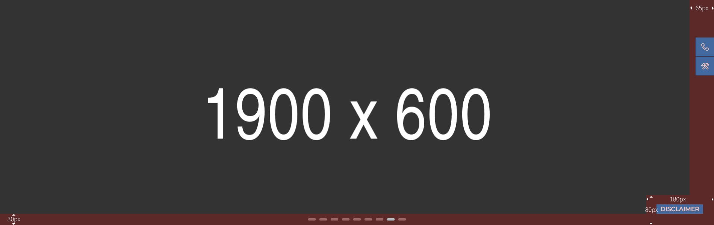
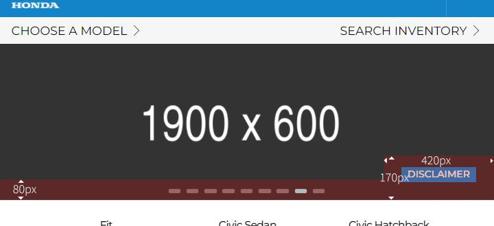
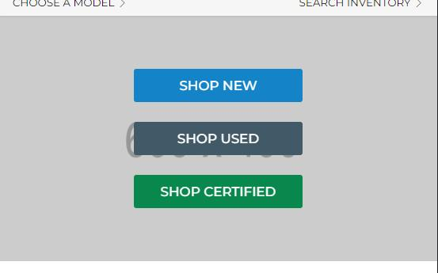

## Hero Slider / Specials Hero

> 1900px x 600px

**Uwagi:**

- Na dolnej krawędzi znajdują sie 'dots' do przełączania slidów
- W prawym dolnym rogu może pojawić się przycisk 'disclaimer' jeżeli wypełnimy treść w panelu
- Do prawej krawędzi strony przyklejone mogą być pływające przyciski 'szybkich akcji'

***Na desktop te wymiary które mogą być zajęte są stosunkowo małe***

***Ale na tabletach obrazek zmniejsza się proporcjonalnie a dots/dislaimer pozostają duże by umożliwić interakcję (szybkie akcje idą w footer na mobilnych i nie przysłaniają)***

> Dlatego idealnie byłoby nie dawać istotnych napisów przy dolnej krawędzi na wysokość 80px oraz prawej krawędzi na szerokość 100px. Do tego ewentualnie w prawym dolnym rogu 420px x 170px jeżeli użyjemy funkcjonalności disclaimera. Wtedy na dowolnym ekranie nic istotnego nie zostanie przysłonięte.

W **special hero** nie ma dots a ***'szybkie akcje'*** nie przysłonią obrazka. Więc trzeba tylko pamiętać o przestrzeni na przycisk 'disclaimer'.

## Mobile Hero Background

> 600px x 400px

Obrazek zostanie użyty jako tło pod przyciski. Wypełni całą wolną przestrzeń której wysokość zależna będzie od ilości przycisków.

**Uwagi:**

- W przypadku gdy znajdzie się tam więcej przycisków niż 3 to warto dać obrazek wyższy niż 400px, jednak nie jest to niezbędne.