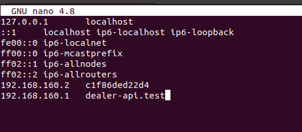

## Uruchamianie lokalnie servera dla SSR <!-- {docsify-ignore} -->

***Przygotowanie środowiska***

1) W pliku `/etc/hosts` podać adres IP dla hosta pod którym dostępne jest API. W zależności od podsieci stworzonej przez docker-a adres może być różny, ale w pliku /etc/hosts powinien się znajdować adres tego kontenera np. `192.168.160.2`, jako adres api wystarczy więc wskazać adres bramy np. `192.168.160.1`

2) Uruchomić `npm run build:dev-server` żeby przygotować pliki w katalogu `dist` które są skonfigurowane pod lokalne działanie

3) Uruchomić `npm run run-server` żeby uruchomić plik `server/main.js` z aktualnego atalogu `dist`

4) Kroki 2. i 3. można wykonać za pomocą jednej komendy `npm run build-run:dev-server`
