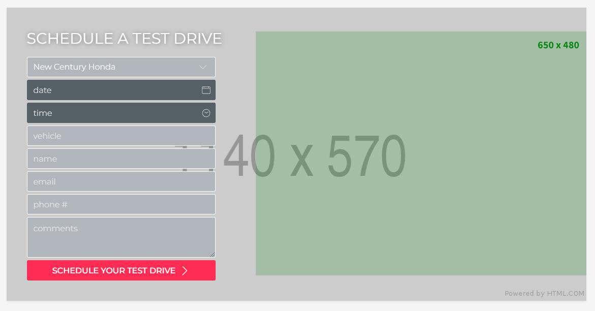
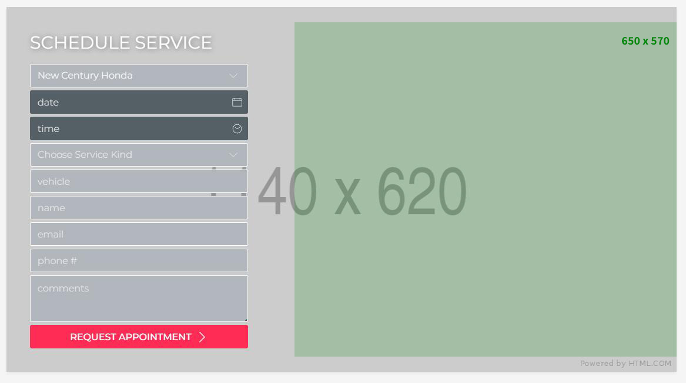
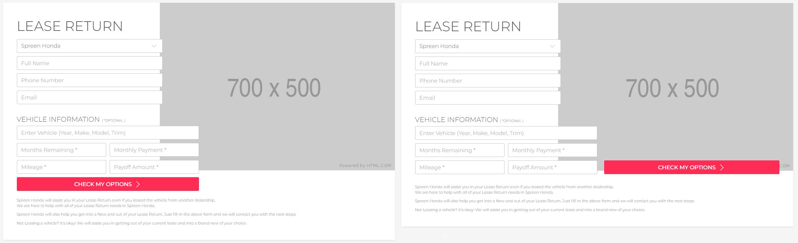
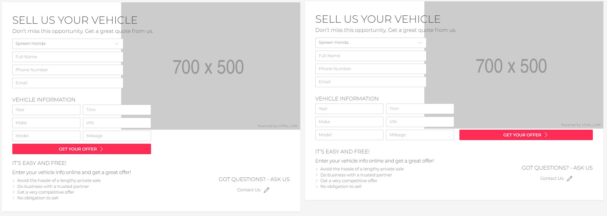

## Schedule a Test Drive

> 1140px x 570px (wysokość formularza może być niższa)

**Uwagi:**

- Formularz może nie zawierać selecta z wyborem dilera
- Formularz może nie zawierać inputa dla vin jeżeli otwierany jest z vdp/srp konkretnej oferty
- Formularz może nie zawierać dodatkowej treści 'Let's have a ...'

Minimalnie formularz będzie miał 480px. Więc obrazek powinien mieć bezpieczny obszar 480px wysokości wyśrodkowany na 570px obrazka.
Dodatkowo lewe 35% obrazka (a na tabletach 40%) będzie przysłonięte przez formularz.

## Schedule Service

> 1140px x 620px (wysokość formularza może być niższa)

**Uwagi:**

- Formularz może nie zawierać selecta z wyborem dilera

Minimalnie formularz będzie miał 570px. Więc obrazek powinien mieć bezpieczny obszar 570px wysokości wyśrodkowany na 620px obrazka.
Dodatkowo lewe 35% obrazka (a na tabletach 40%) będzie przysłonięte przez formularz.

## Lease Return

> 700px x 500px

**Uwagi:**

- Formularz może nie zawierać selecta z wyborem dilera
- W formularzu można zmienić umiejscowienie przycisku submit

Obrazek na jednolitym bardzo jasnym tle. Bez elementów stykających się z jego krawędzią. Najlepiej z minimum 50px bezpiecznym marginesem dookoła.

## Sell Us Your Vehicle

> 700px x 500px

**Uwagi:**

- Formularz może nie zawierać selecta z wyborem dilera
- W formularzu można zmienić umiejscowienie przycisku submit

Obrazek na jednolitym bardzo jasnym tle. Z dużymi marginesami dookoła.

## Quick Quote

> 1140px x 570px
**Uwagi:**

- Sytuacja identyczna jak przy [Schedule a Test Drive](/graphics/forms#schedule-a-test-drive)